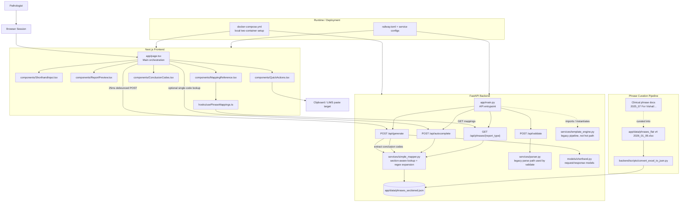

# System Architecture

This repository is a two-service application for turning kidney biopsy shorthand into standardized report text for pathologists.

## Mermaid Diagram

## Active Runtime Flow

1. The user types shorthand or free text into the frontend textarea.
2. `frontend/app/page.tsx` waits 25ms after input changes, then posts raw text to `POST /api/generate`.
3. `backend/app/main.py` walks the input character by character.
4. Tokens are only expanded on word boundaries.
5. `@...@` blocks are preserved literally.
6. `!` headers switch section context so the same key can map differently in `main_body`, `conclusion`, or `comments`.
7. `SimpleMapper` resolves direct keys first, then regex keys from `phrases_sectioned.json`.
8. The backend returns generated report text plus extracted conclusion codes.
9. The frontend renders the report preview, shows conclusion codes, and can copy the final text to the clipboard.
10. The reference modal independently fetches the full mapping set from `GET /api/phrases/{report_type}`.

## Source-Of-Truth Hierarchy

Use this order when reasoning about the product:

1. Runtime code in `frontend/app/page.tsx`, `backend/app/main.py`, and `backend/app/services/simple_mapper.py`
2. Phrase data in `backend/app/data/phrases_sectioned.json`
3. Excel source in `backend/app/data/phrases_flat v4 2026_01_09.xlsx`
4. Conversion script in `backend/scripts/convert_excel_to_json.py`
5. Human docs such as `README.md`, `CLAUDE.md`, `context.md`, `prompt.md`, and `task_log.md`

## Transitional Or Legacy Areas

- `backend/app/services/parser.py` is still used by `/api/validate`, but not by the main report-generation path.
- `backend/app/services/template_engine.py` and `backend/app/services/report_formatter.py` are historical artifacts from the older pipeline.
- `backend/test_example.py` exercises the old parser/template flow rather than the current hot path.
- `frontend/types/report.ts`, `frontend/utils/editDetector.ts`, and `line_mappings` in `backend/app/models/shorthand.py` describe an edit-overlay direction that is not currently wired into `frontend/app/page.tsx`.
- `frontend/next.config.js` contains an `/api/*` rewrite, but the current frontend axios calls use `NEXT_PUBLIC_API_URL` directly.

## Where To Go Deeper

| Topic | Best file(s) to read |
| --- | --- |
| Current user flow | `frontend/app/page.tsx` |
| Input and preview UI | `frontend/components/ShorthandInput.tsx`, `frontend/components/ReportPreview.tsx`, `frontend/components/MappingReference.tsx` |
| API surface | `backend/app/main.py` |
| Mapping logic | `backend/app/services/simple_mapper.py` |
| Phrase source data | `backend/app/data/phrases_sectioned.json` |
| Phrase regeneration pipeline | `backend/scripts/convert_excel_to_json.py`, `backend/app/data/phrases_flat v4 2026_01_09.xlsx` |
| Clinical/domain source material | `2025_07 For Vishal/Standard phrases - Transplant v2.md`, template text files in `2025_07 For Vishal/` |
| Deployment | `docker-compose.yml`, `backend/Dockerfile`, `frontend/Dockerfile`, `railway.toml`, `backend/railway.toml`, `frontend/railway.toml` |
